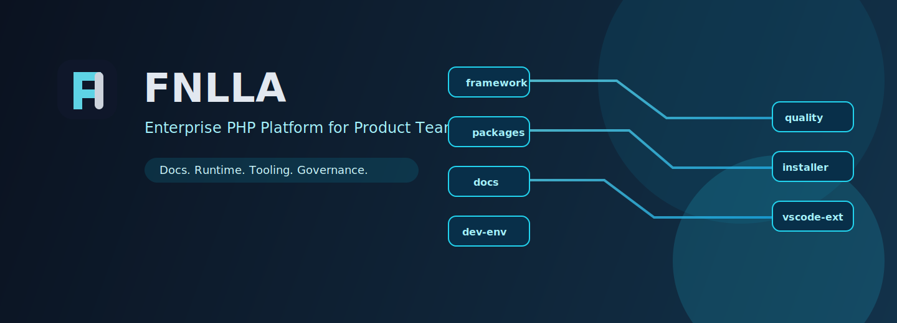
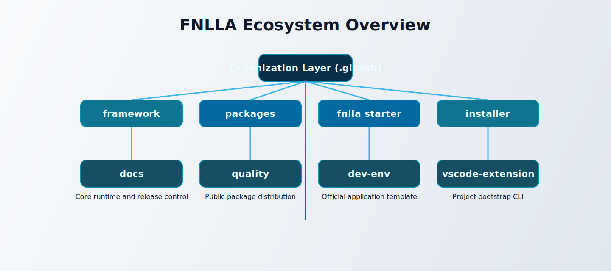

# FNLLA



**ORCHESTRATED**

FNLLA is an enterprise-grade PHP platform designed for product organizations that need both speed and operational confidence. It combines a developer-friendly open-source experience with governance patterns required by security-sensitive and scale-focused teams.

The FNLLA ecosystem is intentionally split into dedicated repositories so each concern can evolve independently: core runtime, package distribution, installer flow, documentation, quality tooling, local runtime, and editor integrations. This structure reduces coupling, improves maintainability, and supports parallel delivery across platform teams.

## Mission

Deliver a production-first framework ecosystem that keeps local development simple while preserving strong release discipline, clear ownership boundaries, and predictable upgrade paths.

## Ecosystem Map



## Featured Repositories

| Repository | Role | Visibility |
|---|---|---|
| `fnlla/framework` | Source-of-truth framework and release governance | Private |
| `fnlla/packages` | Public Composer distribution metadata and artifacts | Public |
| `fnlla/fnlla` | Official starter application template | Public |
| `fnlla/installer` | Bootstrap CLI (`fnlla new`) | Public |
| `fnlla/docs` | Dedicated versioned documentation portal | Public |
| `fnlla/quality` | Official style and QA tooling | Public |
| `fnlla/dev-env` | Official Docker-based local development runtime | Public |
| `fnlla/fnlla-vs-code-extension` | Official VS Code productivity extension | Public |
| `fnlla/.github` | Org-wide community standards and policy defaults | Public |

## Architecture Principles

1. Clear repository boundaries over monolithic coupling.
2. Public developer experience with controlled release surfaces.
3. Documentation and tools versioned as first-class products.
4. Stable enterprise defaults with explicit extension points.
5. CI-first quality gates and repeatable automation.

## Engineering Standards

- Security policies and support channels are centrally governed.
- Default templates, contribution rules, and PR conventions are shared org-wide.
- Critical repositories maintain dedicated CODEOWNERS and release controls.
- Backward compatibility and migration notes are expected for ecosystem-impacting changes.

## Platform Tracks

- **Application Teams**: start with `fnlla/fnlla`, build features, ship with confidence.
- **Platform Teams**: evolve `framework`, `quality`, and `dev-env` with governance.
- **Documentation Teams**: publish and version docs independently in `fnlla/docs`.
- **Developer Experience Teams**: improve feedback loops via `fnlla-vs-code-extension`.

## Why Teams Choose FNLLA

- Production-focused defaults without sacrificing developer speed.
- A clean separation between core framework governance and public onboarding.
- Official tooling for docs, quality, local runtime, and editor workflows.
- A structure that scales from startup product teams to enterprise platform groups.

## Get Started

### Starter via Composer

```bash
composer create-project fnlla/fnlla my-app
```

### Starter via Installer

```bash
composer global require fnlla/installer:dev-main
fnlla new my-app
```

### Security Contact

`security@fnlla.co.uk`
